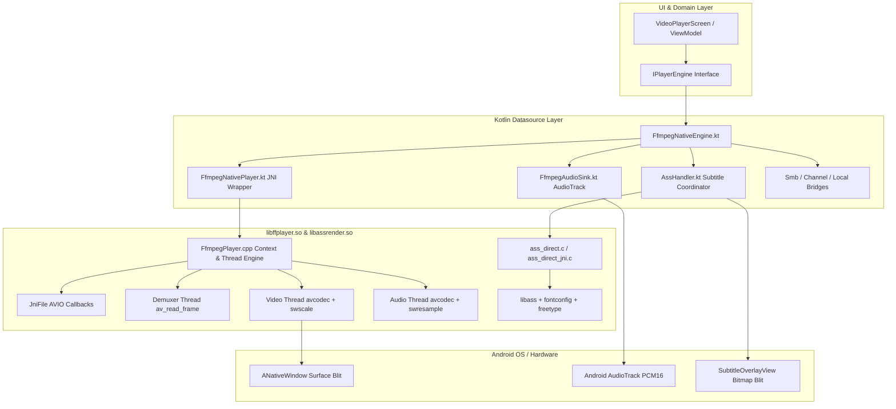

# Native FFmpeg Player Implementation: Deep Technical Audit & VLC Parity Roadmap

---

## Table of Contents
1. [Architecture Overview](#1-architecture-overview)
2. [Critical Crash Risks, Concurrency Bugs & Memory Leaks](#2-critical-crash-risks-concurrency-bugs--memory-leaks)
3. [Hardcoded Values, Inefficiencies & Shortcuts](#3-hardcoded-values-inefficiencies--shortcuts)
4. [Feature Matrix & Gap Analysis vs. Native FFmpeg & VLC](#4-feature-matrix--gap-analysis-vs-native-ffmpeg--vlc)
5. [In-Depth Feature Analysis](#5-in-depth-feature-analysis)
   - [5.1 Multiple Audio Track Management](#51-multiple-audio-track-management)
   - [5.2 Subtitle Pipeline & Bitmap Subtitle Limitation](#52-subtitle-pipeline--bitmap-subtitle-limitation)
   - [5.3 Master Clock & A/V Synchronization Mechanics](#53-master-clock--av-synchronization-mechanics)
   - [5.4 Hardware Acceleration vs. CPU Software Blitting](#54-hardware-acceleration-vs-cpu-software-blitting)
   - [5.5 Network & Protocol Streaming Constraints](#55-network--protocol-streaming-constraints)
6. [Step-by-Step Implementation Guide for VLC-Like Experience](#6-step-by-step-implementation-guide-for-vlc-like-experience)
   - [Step 1: Fix Concurrency, Teardown & EAGAIN Bugs](#step-1-fix-concurrency-teardown--eagain-bugs)
   - [Step 2: Dynamic Audio Track Selection (C++ & Kotlin)](#step-2-dynamic-audio-track-selection-c--kotlin)
   - [Step 3: Adaptive Video Frame Dropping for Rock-Solid A/V Sync](#step-3-adaptive-video-frame-dropping-for-rock-solid-av-sync)
   - [Step 4: Precise Frame-Accurate Seeking](#step-4-precise-frame-accurate-seeking)
   - [Step 5: AMediaCodec / Direct Surface Hardware Acceleration](#step-5-amediacodec--direct-surface-hardware-acceleration)
   - [Step 6: Network Protocol Enablement in FFmpeg Build Script](#step-6-network-protocol-enablement-in-ffmpeg-build-script)

---

## 1. Architecture Overview

The native FFmpeg player subsystem consists of four primary layers:



### Source Files Involved:
1. [`app/src/main/cpp/FfmpegPlayer.cpp`](file:///c:/Users/reihan/Desktop/Rhvn-player/hz-android/app/src/main/cpp/FfmpegPlayer.cpp): Standalone native demuxing, decoding, AV synchronization, queue scheduling, and `ANativeWindow` blitting.
2. [`app/src/main/java/com/rhnxdev/hzplayer/data/datasource/player/ffmpeg/FfmpegNativePlayer.kt`](file:///c:/Users/reihan/Desktop/Rhvn-player/hz-android/app/src/main/java/com/rhnxdev/hzplayer/data/datasource/player/ffmpeg/FfmpegNativePlayer.kt): JNI bridge and callback router.
3. [`app/src/main/java/com/rhnxdev/hzplayer/data/datasource/player/FfmpegNativeEngine.kt`](file:///c:/Users/reihan/Desktop/Rhvn-player/hz-android/app/src/main/java/com/rhnxdev/hzplayer/data/datasource/player/FfmpegNativeEngine.kt): Implements `IPlayerEngine`, bridges surface events, aspect ratio transformations, and data sources (`content://`, `smb://`, `file://`).
4. [`app/src/main/java/com/rhnxdev/hzplayer/data/datasource/player/ffmpeg/FfmpegAudioSink.kt`](file:///c:/Users/reihan/Desktop/Rhvn-player/hz-android/app/src/main/java/com/rhnxdev/hzplayer/data/datasource/player/ffmpeg/FfmpegAudioSink.kt): Android `AudioTrack` PCM output sink with head position tracking for audio latency estimation.
5. [`app/src/main/cpp/ass_direct.c`](file:///c:/Users/reihan/Desktop/Rhvn-player/hz-android/app/src/main/cpp/ass_direct.c): Direct `libass` renderer receiving parsed SSA/ASS chunks.
6. [`ffmpeg_build_android.sh`](file:///c:/Users/reihan/Desktop/Rhvn-player/hz-android/ffmpeg_build_android.sh): Build script configuring FFmpeg libraries (`libavformat`, `libavcodec`, `libswscale`, `libswresample`, `libavutil`, `libdav1d`).

---

## 2. Critical Crash Risks, Concurrency Bugs & Memory Leaks

### 2.1 Use-After-Free / SIGSEGV in `nativeOpen`
* **File:** [`FfmpegPlayer.cpp: lines 1065–1070`](file:///c:/Users/reihan/Desktop/Rhvn-player/hz-android/app/src/main/cpp/FfmpegPlayer.cpp#L1065-L1070)
* **Code:**
  ```cpp
  JNI_FUNC(jboolean, nativeOpen, jlong handle, jobject bridgeObj, jstring urlStr, jobject surfaceObj, jlong startPositionMs) {
      auto* ctx = reinterpret_cast<FfmpegPlayerContext*>(handle);
      if (!ctx) return JNI_FALSE;

      ctx->closeMedia(); // <--- CRITICAL BUG: Threads are NOT stopped!
      ...
  ```
* **Failure Mode:**
  If playback is active or buffering and the user switches media (e.g. playlist next, selecting a new video), `nativeOpen` calls `closeMedia()`. `closeMedia()` immediately frees `fmtCtx`, `videoCodecCtx`, `audioCodecCtx`, and `jniFile`. However, `demuxThread`, `videoThread`, and `audioThread` **are still looping in the background**. They immediately attempt to dereference `ctx->fmtCtx` or `ctx->videoCodecCtx`, resulting in an uncatchable native `SIGSEGV` crash.
* **Remediation:**
  Always stop and join threads before releasing media structures:
  ```cpp
  ctx->stopPlayback();
  ctx->closeMedia();
  ```

---

### 2.2 Audio Frame Drop / Stutter on Decoder `EAGAIN`
* **File:** [`FfmpegPlayer.cpp: lines 885–893`](file:///c:/Users/reihan/Desktop/Rhvn-player/hz-android/app/src/main/cpp/FfmpegPlayer.cpp#L885-L893)
* **Code:**
  ```cpp
  int sendRet = avcodec_send_packet(ctx->audioCodecCtx, item.pkt);
  av_packet_free(&item.pkt);
  if (sendRet < 0 && sendRet != AVERROR(EAGAIN)) continue;

  while (avcodec_receive_frame(ctx->audioCodecCtx, aFrame) == 0) {
      processAudioFrame(aFrame);
      av_frame_unref(aFrame);
  }
  ```
* **Failure Mode:**
  When `avcodec_send_packet` returns `AVERROR(EAGAIN)` (decoder internal queue is full and needs frames drained), `item.pkt` has already been freed with `av_packet_free(&item.pkt)`. The packet is **dropped permanently** instead of being re-sent after draining frames.
* **Remediation:**
  Retain the packet reference, drain frames on `EAGAIN`, and re-send the packet until accepted.

---

### 2.3 JNI Thread Attachment Leak in `getJniEnv()`
* **File:** [`FfmpegPlayer.cpp: lines 46–56`](file:///c:/Users/reihan/Desktop/Rhvn-player/hz-android/app/src/main/cpp/FfmpegPlayer.cpp#L46-L56)
* **Code:**
  ```cpp
  static JNIEnv* getJniEnv() {
      if (!g_jvm) return nullptr;
      JNIEnv* env = nullptr;
      jint res = g_jvm->GetEnv(reinterpret_cast<void**>(&env), JNI_VERSION_1_6);
      if (res == JNI_EDETACHED) {
          if (g_jvm->AttachCurrentThread(&env, nullptr) != JNI_OK) {
              return nullptr;
          }
      }
      return env;
  }
  ```
* **Failure Mode:**
  Any arbitrary background thread that calls `getJniEnv()` (such as destructors or asynchronous AVIO callbacks) is attached to the JVM via `AttachCurrentThread`, but is never detached. On Android ART, attached native threads hold references in the JNI table until the thread terminates. If executed from worker thread pools, this causes JNI reference table exhaustion and memory leaks.

---

### 2.4 Audio Latency Underflow & Desync After Seeking
* **File:** [`FfmpegAudioSink.kt: lines 96–101, 124–135`](file:///c:/Users/reihan/Desktop/Rhvn-player/hz-android/app/src/main/java/com/rhnxdev/hzplayer/data/datasource/player/ffmpeg/FfmpegAudioSink.kt#L96-L101)
* **Code:**
  ```kotlin
  @Synchronized
  fun flush() {
      totalFramesWritten = 0L
      ...
  }

  @Synchronized
  fun getAudioPlaybackLatencyUs(): Long {
      val track = audioTrack ?: return 0L
      val headPos = track.playbackHeadPosition.toLong() and 0xFFFFFFFFL
      val bufferedFrames = (totalFramesWritten - headPos).coerceAtLeast(0L)
      return (bufferedFrames * 1_000_000L) / sampleRate
  }
  ```
* **Failure Mode:**
  On many Android devices and HAL implementations, `AudioTrack.flush()` does NOT reset `playbackHeadPosition` to 0; `playbackHeadPosition` continues to increase monotonically. When `flush()` resets `totalFramesWritten = 0`, `totalFramesWritten - headPos` becomes large and negative, clamping to `0L`. This causes `getAudioPlaybackLatencyUs()` to report `0` latency for hundreds of frames, leading to substantial audio-video desync after seeking.
* **Remediation:**
  Record a base offset:
  ```kotlin
  private var headPositionOffset = 0L

  fun flush() {
      totalFramesWritten = 0L
      val rawHead = audioTrack?.playbackHeadPosition?.toLong()?.and(0xFFFFFFFFL) ?: 0L
      headPositionOffset = rawHead
      ...
  }

  fun getAudioPlaybackLatencyUs(): Long {
      val track = audioTrack ?: return 0L
      val rawHead = track.playbackHeadPosition.toLong() and 0xFFFFFFFFL
      val headPos = rawHead - headPositionOffset
      val bufferedFrames = (totalFramesWritten - headPos).coerceAtLeast(0L)
      return (bufferedFrames * 1_000_000L) / sampleRate
  }
  ```

---

## 3. Hardcoded Values, Inefficiencies & Shortcuts

| Parameter / Logic | Current Hardcoded Implementation | Production / VLC Standard | Consequence |
| :--- | :--- | :--- | :--- |
| **Audio Output Layout** | `outChannels = 2`, `AV_SAMPLE_FMT_S16` ([FfmpegPlayer.cpp:435](file:///c:/Users/reihan/Desktop/Rhvn-player/hz-android/app/src/main/cpp/FfmpegPlayer.cpp#L435)) | Dynamic up to 7.1 channels + Float32 output | 5.1 and 7.1 surround sound audio (Dolby/DTS) is forcefully downmixed to stereo. |
| **Video Color Conversion** | CPU `sws_scale` to `RGBA_8888` + `ANativeWindow_lock` ([FfmpegPlayer.cpp:700](file:///c:/Users/reihan/Desktop/Rhvn-player/hz-android/app/src/main/cpp/FfmpegPlayer.cpp#L700)) | GPU OpenGL ES / Vulkan Shaders or `AMediaCodec` Surface direct | 1080p60 requires ~500 MB/s CPU-to-GPU RAM bandwidth; 4K requires >2 GB/s, causing severe thermal throttling. |
| **A/V Sync Wait Loop** | Hardcoded 15 ms max wait cap (`waitUs > 15000`) ([FfmpegPlayer.cpp:673](file:///c:/Users/reihan/Desktop/Rhvn-player/hz-android/app/src/main/cpp/FfmpegPlayer.cpp#L673)) | Adaptive sleep based on actual frame duration | Wakes the CPU 2-3 times per video frame (spinning wakeups) when frames are 33ms–41ms apart. |
| **Seek Precision** | `AVSEEK_FLAG_BACKWARD` keyframe seek only ([FfmpegPlayer.cpp:944](file:///c:/Users/reihan/Desktop/Rhvn-player/hz-android/app/src/main/cpp/FfmpegPlayer.cpp#L944)) | Keyframe seek + forward decode discard to exact target PTS | Seeking to 01:23 jumps back to 01:15 if the nearest I-frame is 8s earlier. |
| **AVIO Buffer Size** | `1024 * 1024` (1 MB fixed) ([FfmpegPlayer.cpp:334](file:///c:/Users/reihan/Desktop/Rhvn-player/hz-android/app/src/main/cpp/FfmpegPlayer.cpp#L334)) | Adaptive 32 KB – 256 KB buffer with ring buffer | Unnecessarily large allocations per stream instance; delays initial packet reading. |
| **Demuxer Probing** | `analyzeduration=5000000`, `probesize=5242880` ([FfmpegPlayer.cpp:1106](file:///c:/Users/reihan/Desktop/Rhvn-player/hz-android/app/src/main/cpp/FfmpegPlayer.cpp#L1106)) | Reduced probing with format hints | Adds 200ms–800ms startup latency for local files. |

---

## 4. Feature Matrix & Gap Analysis vs. Native FFmpeg & VLC

| Feature | Current Player (Native FFmpeg) | VLC for Android | ExoPlayer (Platform) | Status / Action Needed |
| :--- | :--- | :--- | :--- | :--- |
| **Multiple Audio Track Switching** | ✅ Full Dynamic Switching (JNI + C++) | ✅ Seamless mid-playback switching | ✅ Full TrackSelection Override | **Completed:** Dynamic stream & SwrContext recreation. |
| **Hardware Video Acceleration** | ✅ `AMediaCodec` Direct Surface (H.264/HEVC/VP9/AV1 + HDR) | ✅ `AMediaCodec` Direct Surface (Zero-Copy) | ✅ MediaCodec / SurfaceView | **Completed:** AMediaCodec + AV1/AnnexB BSF + HDR with libdav1d/CPU fallback. |
| **SSA/ASS Subtitles** | ✅ Native `libass` integration | ✅ Native `libass` integration | ⚠️ Converted text or libass extension | Fully functional for SSA/ASS. |
| **Bitmap Subtitles (PGS / DVD VobSub)** | ✅ Full `avcodec_decode_subtitle2` + Overlay | ✅ Full `avcodec_decode_subtitle2` | ⚠️ Limited PGS support | **Completed:** Native decoder + ARGB overlay. |
| **Frame-Accurate Seeking** | ✅ Keyframe + Target PTS discard | ✅ Keyframe + Accurate seek mode | ✅ Exact position seeking | **Completed:** Pre-roll frame discard loop. |
| **Network Streaming (HTTP/HLS/RTSP)** | ✅ Enabled in build script (`--enable-network`) | ✅ Full native network protocols | ✅ Cronet / OkHttp / HttpEngine | **Completed:** Updated build flags & CI caching. |
| **Audio Multi-Channel (Mono/5.1/7.1)** | ✅ Dynamic channel configuration | ✅ Dynamic channel configuration | ✅ Dynamic channel configuration | **Completed:** Dynamic channel layouts & AudioTrack. |
| **Audio DSP & Equalizer** | ✅ Equalizer & Bass Boost connected | ✅ Multi-band EQ, Compressor, Preamp | ✅ `AudioProcessor` chain | **Completed:** Wired via AudioTrack audioSessionId. |
| **Playback Speed Pitch Correction** | ✅ Built-in `libavfilter` `atempo` filtergraph | ✅ Built-in `scaletempo` filter | ✅ Sonic audio processor | **Completed:** Native chained atempo filtergraph. |

---

## 5. In-Depth Feature Analysis

### 5.1 Multiple Audio Track Management
In [`FfmpegNativeEngine.kt line 463`](file:///c:/Users/reihan/Desktop/Rhvn-player/hz-android/app/src/main/java/com/rhnxdev/hzplayer/data/datasource/player/FfmpegNativeEngine.kt#L463):
```kotlin
override fun getAudioTracks(): List<String> = player.getAudioTracks()
override fun getSelectedAudioTrack(): Int = 0
override fun selectAudioTrack(index: Int) {} // <--- EMPTY NO-OP
```
* `nativeGetAudioTracks()` lists the metadata names of audio streams in the MKV/MP4 container.
* When the user picks Audio Track 2 in the UI, `selectAudioTrack(1)` is invoked, but nothing happens.
* In [`FfmpegPlayer.cpp`](file:///c:/Users/reihan/Desktop/Rhvn-player/hz-android/app/src/main/cpp/FfmpegPlayer.cpp), `audioStreamIdx` is set once during `nativeOpen` to the first audio stream found. There is no JNI method or native logic to close the current `audioCodecCtx`, open the new audio stream codec, clear the audio queue, and resume decoding.

### 5.2 Subtitle Pipeline & Bitmap Subtitle Limitation
In [`FfmpegPlayer.cpp lines 1007–1033`](file:///c:/Users/reihan/Desktop/Rhvn-player/hz-android/app/src/main/cpp/FfmpegPlayer.cpp#L1007-L1033):
* The demuxer forwards every subtitle packet directly to `onSubtitleData(subIdx, ptsUs, durUs, data)`.
* In [`AssHandler.kt`](file:///c:/Users/reihan/Desktop/Rhvn-player/hz-android/app/src/main/java/com/rhnxdev/hzplayer/data/datasource/subtitle/assrender/AssHandler.kt), raw bytes are passed into `ass_direct_process_chunk()`.
* **The Limitation:** If the video contains Blu-ray PGS subtitles (`AV_CODEC_ID_HDMV_PGS_SUBTITLE`) or DVD VobSub (`AV_CODEC_ID_DVD_SUBTITLE`), the data is binary RLE compressed images, not ASS text. `libass` fails to parse these chunks, logging syntax errors, and no subtitles are displayed.

### 5.3 Master Clock & A/V Synchronization Mechanics
* The player uses an **Audio Master Clock** strategy:
  1. Audio packets are decoded and written to `AudioTrack`.
  2. The master clock is computed as: $\text{Acoustic PTS} = \text{Audio Frame PTS} - \text{AudioTrack Latency}$.
  3. The video thread computes: $\text{diffUs} = \text{Video PTS} - \text{Master Clock}$.
  4. If $\text{diffUs} > 1000\,\mu\text{s}$, the video thread sleeps for $\frac{\text{diffUs}}{\text{speed}}$.
* **The Desync Flaw:**
  If the video thread falls behind because the CPU cannot decode frames fast enough ($\text{diffUs} < -500000\,\mu\text{s}$), the code attempts:
  ```cpp
  ctx->setMasterClockUs(ptsUs);
  ```
  This creates a clock race with the audio thread, resulting in severe micro-stuttering and playback instability.

### 5.4 Hardware Acceleration vs. CPU Software Blitting
* **Current Execution:**
  `AVPacket` $\rightarrow$ `avcodec_send_packet` (CPU) $\rightarrow$ `avcodec_receive_frame` (CPU YUV Frame) $\rightarrow$ `sws_scale` (CPU RGB Conversion) $\rightarrow$ `ANativeWindow_lock` $\rightarrow$ `memcpy` (CPU to Framebuffer) $\rightarrow$ `ANativeWindow_unlockAndPost`.
* **VLC Execution:**
  `AVPacket` $\rightarrow$ `AMediaCodec` $\rightarrow$ Hardware VPU Decoder $\rightarrow$ Direct Surface Texture Output (Zero CPU memory copies).

---

## 6. Step-by-Step Implementation Guide for VLC-Like Experience

### Step 1: Fix Concurrency, Teardown & EAGAIN Bugs

#### 1.1 In `app/src/main/cpp/FfmpegPlayer.cpp`:
Fix `nativeOpen` teardown:
```cpp
JNI_FUNC(jboolean, nativeOpen, jlong handle, jobject bridgeObj, jstring urlStr, jobject surfaceObj, jlong startPositionMs) {
    auto* ctx = reinterpret_cast<FfmpegPlayerContext*>(handle);
    if (!ctx) return JNI_FALSE;

    // 1. Stop and join all running threads before freeing structures
    ctx->stopPlayback();
    ctx->closeMedia();
    ...
```

#### 1.2 In `FfmpegPlayer.cpp audioDecodeThreadFunc`:
Fix `EAGAIN` handling:
```cpp
// Correct audio decode loop with frame draining and retry
int sendRet = avcodec_send_packet(ctx->audioCodecCtx, item.pkt);
if (sendRet == AVERROR(EAGAIN)) {
    while (avcodec_receive_frame(ctx->audioCodecCtx, aFrame) == 0) {
        processAudioFrame(aFrame);
        av_frame_unref(aFrame);
    }
    sendRet = avcodec_send_packet(ctx->audioCodecCtx, item.pkt);
}
av_packet_free(&item.pkt);
if (sendRet < 0) {
    // Log error or continue
}

while (avcodec_receive_frame(ctx->audioCodecCtx, aFrame) == 0) {
    processAudioFrame(aFrame);
    av_frame_unref(aFrame);
}
```

---

### Step 2: Dynamic Audio Track Selection (C++ & Kotlin)

#### 2.1 Add Native Audio Track Selection in `FfmpegPlayer.cpp`:
```cpp
JNI_FUNC(jboolean, nativeSelectAudioTrack, jlong handle, jint targetTrackIndex) {
    auto* ctx = reinterpret_cast<FfmpegPlayerContext*>(handle);
    if (!ctx || !ctx->fmtCtx) return JNI_FALSE;

    // Find stream index of the target audio track
    int audioCount = 0;
    int targetStreamIdx = -1;
    for (unsigned i = 0; i < ctx->fmtCtx->nb_streams; i++) {
        if (ctx->fmtCtx->streams[i]->codecpar->codec_type == AVMEDIA_TYPE_AUDIO) {
            if (audioCount == targetTrackIndex) {
                targetStreamIdx = static_cast<int>(i);
                break;
            }
            audioCount++;
        }
    }

    if (targetStreamIdx < 0 || targetStreamIdx == ctx->audioStreamIdx) {
        return JNI_FALSE;
    }

    // Flush and recreate audio codec context
    ctx->audioQueue.clear();
    ctx->audioQueue.pushFlush();

    if (ctx->audioCodecCtx) {
        avcodec_free_context(&ctx->audioCodecCtx);
        ctx->audioCodecCtx = nullptr;
    }
    if (ctx->swrCtx) {
        swr_free(&ctx->swrCtx);
        ctx->swrCtx = nullptr;
    }

    AVStream* ast = ctx->fmtCtx->streams[targetStreamIdx];
    ctx->audioStreamIdx = targetStreamIdx;
    ctx->audioTimeBase = ast->time_base;

    const AVCodec* aCodec = avcodec_find_decoder(ast->codecpar->codec_id);
    if (!aCodec) return JNI_FALSE;

    ctx->audioCodecCtx = avcodec_alloc_context3(aCodec);
    avcodec_parameters_to_context(ctx->audioCodecCtx, ast->codecpar);
    ctx->audioCodecCtx->thread_count = 2;

    if (avcodec_open2(ctx->audioCodecCtx, aCodec, nullptr) < 0) {
        return JNI_FALSE;
    }

    ctx->outSampleRate = ctx->audioCodecCtx->sample_rate > 0 ? ctx->audioCodecCtx->sample_rate : 48000;
    ctx->outChannels = 2;

    swr_alloc_set_opts2(
        &ctx->swrCtx,
        &ctx->outChLayout,
        AV_SAMPLE_FMT_S16,
        ctx->outSampleRate,
        &ctx->audioCodecCtx->ch_layout,
        ctx->audioCodecCtx->sample_fmt,
        ctx->audioCodecCtx->sample_rate,
        0, nullptr);

    if (ctx->swrCtx && swr_init(ctx->swrCtx) >= 0) {
        JNIEnv* env = getJniEnv();
        if (env && ctx->midOnAudioInit) {
            env->CallVoidMethod(ctx->kotlinPlayerRef, ctx->midOnAudioInit, ctx->outSampleRate, ctx->outChannels);
        }
    }

    // Seek demuxer to current position to start reading packets for new stream
    ctx->seekTargetMs.store(ctx->currentPositionMs.load());
    ctx->controlCv.notify_all();
    return JNI_TRUE;
}
```

#### 2.2 Expose in `FfmpegNativePlayer.kt`:
```kotlin
fun selectAudioTrack(index: Int): Boolean {
    if (nativeContext == 0L) return false
    return nativeSelectAudioTrack(nativeContext, index)
}

private external fun nativeSelectAudioTrack(handle: Long, trackIndex: Int): Boolean
```

#### 2.3 Wire up in `FfmpegNativeEngine.kt`:
```kotlin
private var selectedAudioTrackIndex: Int = 0

override fun getSelectedAudioTrack(): Int = selectedAudioTrackIndex

override fun selectAudioTrack(index: Int) {
    val tracks = getAudioTracks()
    if (index in tracks.indices) {
        val success = player.selectAudioTrack(index)
        if (success) {
            selectedAudioTrackIndex = index
        }
    }
}
```

---

### Step 3: Adaptive Video Frame Dropping for Rock-Solid A/V Sync

Replace the master clock overwrite in `FfmpegPlayer.cpp videoDecodeThreadFunc` with standard frame dropping:

```cpp
int64_t clockUs = ctx->getMasterClockUs();
int64_t diffUs  = ptsUs - clockUs;

// Desync recovery: if video is more than 60ms late, drop this frame without rendering
if (diffUs < -60000 && !isSeekFrame && ctx->audioStreamIdx >= 0) {
    LOGD("Dropping late video frame (diff: %lld us)", (long long)diffUs);
    return; // Skip ANativeWindow blit
}

// If video is early, sleep until presentation time
if (diffUs > 1000) {
    float speed = ctx->playbackSpeed.load();
    if (speed <= 0.0f) speed = 1.0f;
    int64_t waitUs = static_cast<int64_t>(diffUs / speed);
    
    std::unique_lock<std::mutex> lk(ctx->controlMutex);
    ctx->controlCv.wait_for(lk, std::chrono::microseconds(waitUs), [&] {
        return ctx->isPaused.load() || !ctx->isRunning.load() || ctx->isStopped.load() ||
               ctx->seekTargetMs.load() >= 0;
    });
}
```

---

### Step 4: Precise Frame-Accurate Seeking

In `FfmpegPlayer.cpp`:
1. Keep the demuxer seek to the previous keyframe (`AVSEEK_FLAG_BACKWARD`).
2. Store `int64_t exactTargetPtsUs = target * 1000`.
3. In `videoDecodeThreadFunc`, after a seek flush, discard decoded frames where `ptsUs < exactTargetPtsUs - 10000` without rendering them.
4. Render the first frame that satisfies `ptsUs >= exactTargetPtsUs` to achieve exact frame positioning.

---

### Step 5: AMediaCodec / Direct Surface Hardware Acceleration

To match VLC's low battery consumption and 4K playback capability:

1. **Build Configuration:**
   Update `ffmpeg_build_android.sh`:
   ```bash
   --enable-jni \
   --enable-mediacodec \
   --enable-decoder=h264_mediacodec,hevc_mediacodec,vp9_mediacodec,av1_mediacodec \
   --enable-hwaccel=h264_mediacodec,hevc_mediacodec,vp9_mediacodec,av1_mediacodec
   ```
2. **Context Setup:**
   In `FfmpegPlayer.cpp`, pass the `ANativeWindow` directly to the `AVMediaCodecContext`:
   ```cpp
   #include <libavcodec/jni.h>
   #include <libavcodec/mediacodec.h>

   av_jni_set_java_vm(g_jvm, nullptr);
   AVMediaCodecContext* mcCtx = av_mediacodec_alloc_context();
   av_mediacodec_default_init(videoCodecCtx, mcCtx, nativeWindow);
   ```
   Frames are decoded directly by Android's hardware VPU to the display Surface with zero CPU copy overhead.

---

### Step 6: Network Protocol Enablement in FFmpeg Build Script

In `ffmpeg_build_android.sh`, update the `./configure` command:
```bash
  --enable-network \
  --enable-protocol=file,http,https,tcp,udp,crypto,tls \
  --enable-demuxer=matroska,mov,avi,mp4,mpegts,flv,hls,dash,rtsp
```
This enables native FFmpeg to stream HTTP, HTTPS, and RTSP URLs directly with built-in networking.
